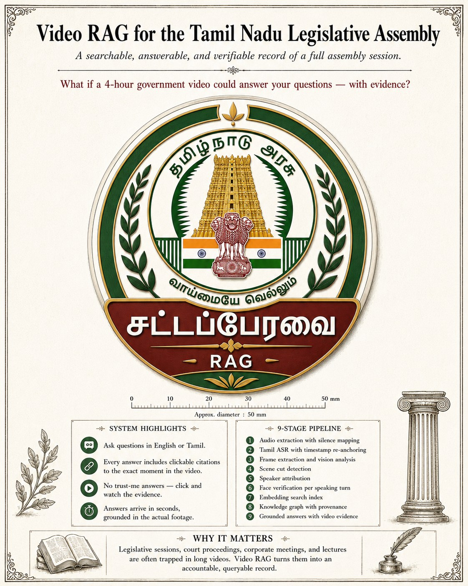
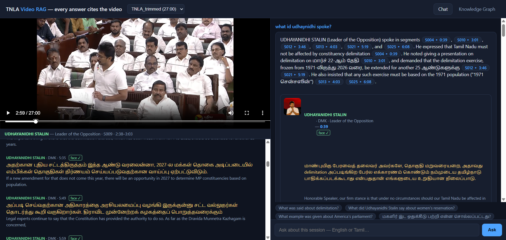
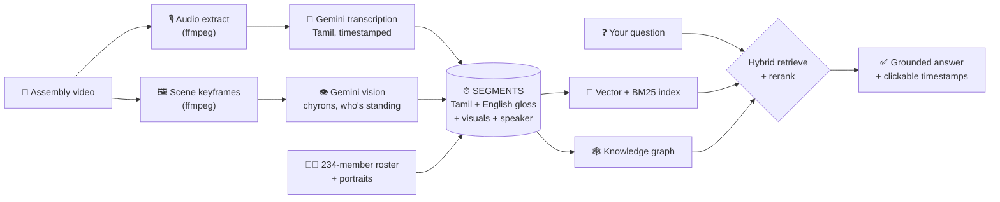

<div align="center">



# 🎥 TNLA Video RAG

### Ask a 4-hour Assembly session anything, in English or Tamil.<br>Every answer comes with clickable proof from the video.

<p>
  
  
  
  
  
  
</p>

**[✨ What it does](#-what-it-does)** · **[🎬 See it in action](#-the-experience)** · **[🧠 How it works](#-how-it-works)** · **[🚀 Quickstart](#-quickstart)**

</div>

<p align="center">
  <a href="https://buymeacoffee.com/karthiaienq"></a>
  <br/>
  <a href="https://buymeacoffee.com/karthiaienq"></a>
</p>

<br>

### ▶️ Watch the demo (2 min)

https://github.com/user-attachments/assets/e51aad45-9ebc-4104-b750-575162d158b0

| 🧑‍⚖️ **234 members** | 🌐 **2 languages** | 🎯 **Every answer cited** | 💰 **Under $1** |
|:---:|:---:|:---:|:---:|
| identified by name, party and face | ask in English or Tamil | click a citation → the video jumps there | to ingest a 27-minute video |

> An AI-powered **"ask-the-video"** system for Tamil Nadu Legislative Assembly footage.
> It *listens* to hours of Tamil speech, *reads* what's on screen, *recognizes* who is speaking —
> then answers your questions with **clickable timestamps** that jump the video to the exact moment,
> every claim backed by visible evidence.

**Non-negotiable rule: every answer cites video evidence. No citation = a bug.**
Built on Assembly footage, but the architecture works for any *long multi-speaker video* domain.

---

## ✨ What it does

Ask a question in **English or Tamil**, like *"What did the Agriculture Minister say about crop insurance?"* and you get:

```
This year 3.98 lakh acres of paddy were insured by 1.34 lakh farmers, with an
allocation of ₹648.55 crore for the crop insurance scheme.
   ▶ S761 · 3:13:10   (click → the video jumps there and plays)
   🗣 VINOTH (TVK) — verified against the official member portrait
   📜 Tamil verbatim shown alongside — numbers always come from the source
```

It combines four things most systems keep separate:

| Capability | What it means |
|---|---|
| 🎙 **Speech understanding** | Tamil audio → verbatim transcript, segmented with drift-corrected timestamps |
| 👁 **Visual understanding** | Scene keyframes → who's standing, on-screen text, name chyrons |
| 🧑‍⚖️ **Speaker identity** | Every segment attributed to one of **234 roster members** (name, party, portrait) — and photo-verified |
| 🕸 **Knowledge graph** | People, parties, schemes, laws, amounts — linked across the whole session, every edge traceable to a segment |

…and it **grounds every answer**: the model can only cite segment ids that exist, *code* (not the model)
maps ids to timestamps, and an answer with no valid evidence is shown as a **refusal — never as fact**.

---

## 🎬 The experience

A clean web app — **video player on the left, chat on the right**, no build step, works offline:

<p align="center">
  
  <br>
  <sub>Every claim links to a segment chip like <code>S010 ▸ 3:01</code>; the speaker card shows the face-verified match.</sub>
</p>

- **Ask → get answer chips like `▸ S012 · 3:46` → click → the player seeks to that second.**
- A **live transcript** scrolls in sync with playback — Tamil verbatim + English gloss, with each speaker's **name, party and official portrait**.
- A **knowledge graph tab** lets you explore who said what about which scheme, law or amount.
- An **ingest dashboard** (`/ingest`) shows the pipeline running phase-by-phase with live progress.

---

## 🧠 How it works



1. **Listen** → audio is chunked and transcribed by Gemini into verbatim Tamil segments; every timestamp
   is **snapped to a real measured pause** and drift-corrected against ffmpeg-known offsets.
2. **Look** → scene-detected keyframes go through Gemini vision: setting, on-screen text, name chyrons,
   who is standing.
3. **Identify** → speakers are **never guessed**: names come from the Speaker's spoken call-outs and
   on-screen graphics, resolved against the closed 234-member roster, then **photo-verified** in lineups
   against official portraits. *"Unidentified" is a legal, displayed value.*
4. **Index & graph** → each segment (Tamil + English gloss + visuals + speaker + timestamps) is embedded
   for hybrid **vector + BM25** search; entities and relations go into a knowledge graph with provenance
   back to segment ids.
5. **Answer** → your question retrieves and reranks the best segments; the model writes an answer that
   cites **segment ids only** — code maps them to timestamps, so a wrong citation is *structurally
   impossible*, not just unlikely.

---

## 🛡 Why you can trust the numbers

> During testing, a capable model translated **"1,000 crore"** as **"1 lakh crore"** — a **100× error**.

That's why this system treats translation as a *search aid, not a source of truth*:

- 📜 **Numbers, dates and amounts shown to you always come from the Tamil verbatim** — never the English translation.
- 🚨 A **numeric guard** cross-checks digits between Tamil and English for every segment and flags mismatches.
- 🧾 Every answer displays the Tamil source text right next to the claim, so you can verify with your own eyes.

---

## 🗂 Tech stack

- **Python 3.11** · **Gemini API** (`gemini-3.5-flash` for transcription/translation/vision, `gemini-embedding-001` for embeddings) · **ffmpeg**
- Hybrid retrieval: **NumPy** vector search + **BM25**, LLM rerank
- Hand-built **HTML/CSS/JS** frontend — *no build step, no CDN, works offline*
- **Disk-cached & resumable** — every API call is cached; a crash resumes where it stopped, re-runs are free
- Optional **Neo4j** export for interactive graph visualization

---

## 🚀 Quickstart

> Requires **Python 3.11+**, **ffmpeg** on PATH, and a **Gemini API key**.
> A 27-minute video ingests in a few minutes for **under $1**; a full ~4-hour session ≈ **$3–5**.

```bash
# 1. Clone
git clone https://github.com/karthi-ai-engineer/TNLA_RAG.git
cd TNLA_RAG

# 2. Install
pip install -r requirements.txt

# 3. Add your Gemini key
cp .env.example .env          # then edit .env → GEMINI_API_KEY=...

# 4. Drop your video into data/videos/  →  e.g. data/videos/TNLA.mp4

# 5. Run the WHOLE pipeline with ONE command — then the UI opens automatically
python ingest.py data/videos/TNLA.mp4 --serve      # → http://127.0.0.1:8000
```

Already ingested? Just:

```bash
python serve.py
```

### 📱 Watching from another device

The server binds **all network interfaces by default**, so anyone on the same Wi-Fi can open the
demo. On startup it prints the exact URL to share:

```
  On this machine :  http://127.0.0.1:8000
  Other devices   :  http://192.168.1.42:8000   <- share this one
```

Want it locked to your machine instead? `python serve.py --host 127.0.0.1`.

If another device can't connect, allow the port through Windows Firewall once, in an
**Administrator** PowerShell:

```powershell
New-NetFirewallRule -DisplayName "TNLA Video RAG" -Direction Inbound -Protocol TCP -LocalPort 8000 -Action Allow -Profile Any
```

> On guest Wi-Fi or a phone hotspot, **client isolation** may block device-to-device traffic
> entirely — no server setting can work around that. Quick check: `ping <your-ip>` from the
> other device.

---

## 🧩 Project structure

```
TNLA_RAG/
├── ingest.py            # ONE command: full pipeline, resumable, phase-skipping
├── serve.py             # the demo UI server (player + chat + graph + ingest dashboard)
├── vrag/                # the library — one module per pipeline stage
│   ├── audio.py         #   audio extraction & chunking (ffmpeg)
│   ├── transcribe.py    #   Gemini Tamil transcription + timestamp correction
│   ├── frames.py        #   scene keyframes + Gemini vision
│   ├── attribute.py     #   speaker attribution (roster + chyrons + call-outs)
│   ├── faceverify.py    #   photo-lineup verification vs official portraits
│   ├── retrieve.py      #   hybrid vector + BM25 search, rerank
│   ├── graph.py         #   knowledge graph extraction (with provenance)
│   ├── answer.py        #   grounded answer generation (segment-id citations only)
│   └── gemini.py        #   one hardened Gemini client (native API, cached)
├── scripts/             # individual phase runners + export_neo4j.py
├── assets/roster/       # all 234 assembly members: names (EN+TA), party, portrait
├── web/                 # single-file frontend (index.html, ingest.html) — no build step
├── docs/                # HOW_IT_WORKS.md (full architecture) · PLAN.md · HANDOFF.md
└── data/                # your videos + generated artifacts (git-ignored)
```

---

## 🕸 Optional: Neo4j graph view

The pipeline needs no database. But if you want the knowledge graph in Neo4j Browser's
interactive visualization (`pip install neo4j`, local Neo4j running):

```bash
python scripts/export_neo4j.py --video-id TNLA --password <dbpass>
```

---

## 💰 Cost

Budget-first by design: one provider (Gemini), every call **disk-cached**, ingestion **resumable**.

| Video length | Ingest cost | Ingest time |
|---|---|---|
| ~27 min | **< $1** | a few minutes |
| ~4 hours | **≈ $3–5** | tens of minutes |

Each question afterward costs a fraction of a cent — and re-running ingest on cached data is **free**.

---

## ⚠️ Honesty & scope

- **No silent fallbacks, no invented data.** If a phase fails, it fails *loudly* — nothing is faked.
- If retrieval finds no supporting evidence, the system **says so** instead of writing a confident guess.
- Speaker identification confidence and face-verification verdicts are **stored and displayed**, not hidden.
- AI transcription and vision are approximate — the Tamil verbatim and clickable video moment are always
  shown so a human can verify in seconds.

---

## 📦 What's in the repo (and what isn't)

**Included:** all source code, the full 234-member roster with portraits, the frontend, docs, and phase scripts.
**Not included (by design):** your `.env` (secret), the videos (supply your own in `data/videos/`), and all
generated artifacts — everything regenerates with one `python ingest.py` run.

---

## 📄 License & data

- **Code:** [MIT License](LICENSE), provided as-is for educational and demonstration purposes.
- **Footage:** Assembly footage belongs to its broadcasters. Supply your own recording and respect its
  license; do not redistribute copyrighted material.
- **Roster:** member names and portraits are from official public sources.
